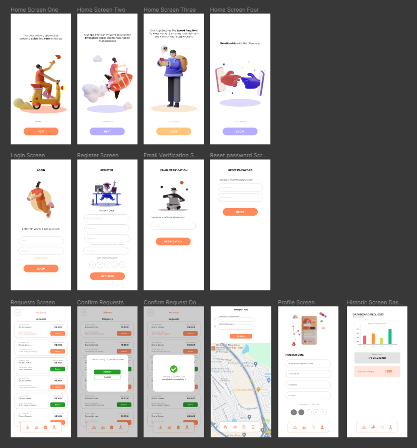

# Delivery BBC - (*Bruno Bosch Cotuca*) - Project mobile 
### Mobile application about transport and logistics, to improve the connection between the seller and the user!
 

 

## About this project

In this project I used <strong>React Native</strong> to create the mobile front-end and <strong>Spring Boot</strong> for the back-end (RestFul API)

## Who?

<strong>Email-me: </strong> brunownog05@gmail.com
 
<strong> Connect with me at with my profile in <a href='https://www.linkedin.com/public-profile/settings?trk=d_flagship3_profile_self_view_public_profile'> LinkedIn</a> </strong>
 
<strong> This project is OpenSource  </strong>

 
 

# Some Observations about this App...
## Functionalities
<strong> 1 - Login and Register </strong>: The user can enter in the Sytem with your E-mail and password. And can register put the your Name completed, password, and number of driver linsense, also choose the What Category You Drive (A, B, C, D, E). Have a email verification and reset password screens, if you forgot your password. This functionality is authorized and authenticated by Beck-End.
 
<strong>2 - Requests</strong>: See all requests and your status
 
<strong> 3 - Create a order (Deliver)</strong>: You can confirm the deliver
 
<strong> 4 - Set location in app </strong>: The user can choose the position. Choose the your current location and chosse the you destiny, and search.
 
<strong> 5 - Change the personal data</strong>: You can choose the personal data in your profile
 
<strong> 6 - See sales amount and total requests</strong>: - You can see the dashboard requests, see the sales amount in Real and Total deliveries
 
 
# Getting Started
 

## FrontEnd
## BackEnd

